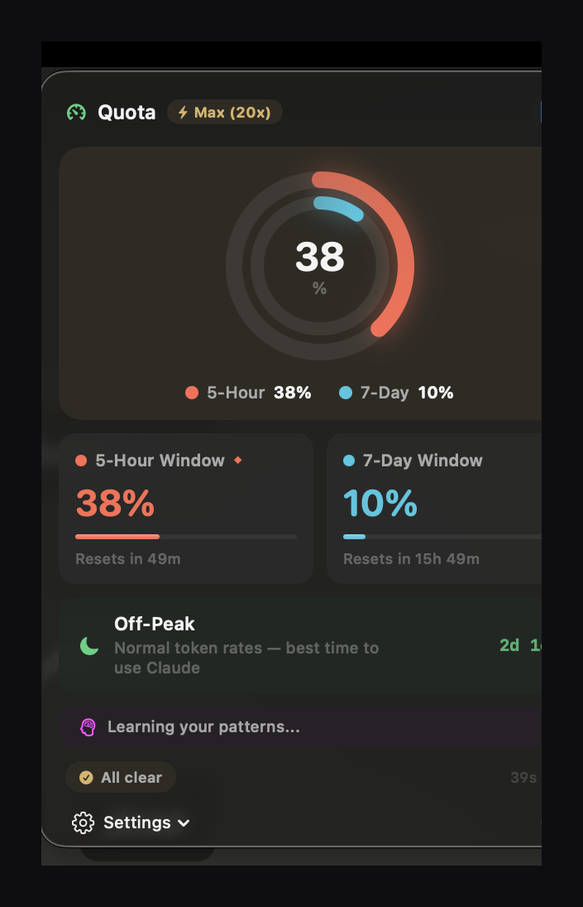

# Quota



A macOS menu bar app that tracks your Claude rate limits and learns your usage patterns to predict when you'll hit the wall.

I kept getting rate-limited mid-conversation with zero warning. Anthropic doesn't surface usage data anywhere useful — it's buried in a settings page that updates once you've already been throttled. So I built Quota: a menu bar gauge that polls every 60 seconds, shows exactly where you stand, and over time learns *how you use Claude* to warn you before it happens.

### Install (paste in Terminal)

```bash
curl -fsSL https://raw.githubusercontent.com/mittxldesigns/Quota/main/install.sh | bash
```

> **Why Terminal?** macOS blocks unsigned apps downloaded from the internet. This is the only way to install without hitting Apple's Gatekeeper warning. It downloads, installs to /Applications, and launches — takes 5 seconds.

## How it's different

There are other Claude usage trackers out there. Here's what Quota does that they don't:

**Learns your patterns.** Most trackers just show you a number. Quota records every data point, builds a usage profile over days and weeks, and starts predicting when you'll hit your limit based on *your actual behavior* — not just a linear projection. The longer you use it, the smarter it gets. It knows your heaviest hours, your heaviest days, and adjusts predictions accordingly.

**Peak/off-peak awareness.** Since March 2026, Anthropic charges more tokens during peak hours (5-11 AM PT weekdays). No other tool tells you this. Quota shows whether you're in peak or off-peak, counts down to the next transition, and notifies you when cheaper rates kick in so you can time heavy usage.

**Plan recommendations.** Based on your actual usage data, Quota tells you if you're overpaying or underpaying for your plan. "You're pushing Pro limits — Max 5x would give you more headroom" or "Light usage for 20x — you could save with 5x."

**Proactive notifications.** Not just "you hit your limit" — Quota warns at 50%, 80%, 95%, tells you when your limit resets, and alerts you when off-peak rates activate. You're never caught off guard.

**Updates itself.** When a new version ships, Quota downloads and installs it in the background. No manual downloads, no DMG hunting.

## What you see

A colored arc gauge in your menu bar. Green when you're good, yellow when you're getting up there, orange when you should slow down, red when you're about to hit it. Click it for the full breakdown:

- 5-hour and 7-day usage rings with exact percentages
- Reset countdowns for both windows
- Peak/off-peak status with time until transition
- Learned predictions: "Avg daily peak: 67% · Heaviest around 3PM · Hitting limit in ~1h 20m"
- Plan upgrade/downgrade tips based on your real data
- Your plan badge (set on first login, changeable in Settings)

## Install

Open Terminal (`Cmd + Space` → type "Terminal") and paste:

```bash
curl -fsSL https://raw.githubusercontent.com/mittxldesigns/Quota/main/install.sh | bash
```

Enter your password when asked. Quota installs and launches — look for it in your menu bar.

macOS 14+ (Sonoma and later). Liquid Glass UI on macOS 26, material design on older versions.

<details>
<summary>Build from source</summary>

```bash
git clone https://github.com/mittxldesigns/Quota.git
cd Quota
bash build.sh --install
open /Applications/Quota.app
```

Needs Xcode 16+.

</details>

## Privacy

Everything runs on your machine. Usage history is stored locally in `~/Library/Application Support/Quota/`. The app talks to two domains — `api.anthropic.com` for usage data and `platform.claude.com` for auth — and that's it. No analytics, no telemetry, no third-party anything. Read the source.

## How it works

OAuth PKCE login (same flow as Claude Code — no API key), polls `/api/oauth/usage` every 60 seconds. That endpoint returns your utilization as a percentage — it doesn't consume any of your quota. Credentials stored with 600 permissions, tokens refresh automatically.

The prediction engine records a snapshot on every poll, deduplicates to ~10 minute intervals, and keeps up to 2 weeks of history. It uses a weighted moving average (recent usage matters more) to estimate burn rate, tracks your per-hour and per-day patterns, and surfaces predictions once it has enough data. The model improves over days as it sees full usage cycles.

Four Swift files, no dependencies, no Xcode project. Just `swiftc` and a build script.

## License

MIT

---

Made by [Tanish Mittal](https://contra.com/mittxldesigns)
